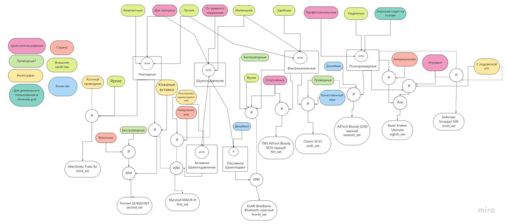

# Отчет по лабораторной работе
## по курсу "Искусственый интеллект"

### Студенты: 

| ФИО       | Роль в проекте                     |
|-----------|------------------------------------|
| Спиридонов К. А.| Реализовал интерфейс, разработка модели знаний, отчет|
| Тимофеев А. В. | Инженер по знаниям, разработка модели знаний, отчет |
| Барсов А. В.| Составление базы знаний, разработка модели знаний, отладка|
| Савин А. А.| Инженер по знаниям, разработка модели знаний, составление базы знаний |

## Результат проверки

| Преподаватель     | Дата         |  Оценка       |
|-------------------|--------------|---------------|
| Сошников Д.В. |              |               |

## Тема работы

Создание экспертной системы для выбора наушников и гарнитур.

Во время создания системы использовались наши знания о рынке наушников и опыт выбора наушников, а также, знания которые мы смогли почерпнуть в интернете.

Мы позиционируем данную экспертную систему как программу, которая поможет людям в выборе наушников, даже если они не разбираются в этой предметной области. От пользователя требуется ввести факты и требования к наушникам, а наша программа предложит один или несколько вариантов товара, которые удовлетворяют его потребностям. 


## Концептуализация предметной области

Во время концептуализации были выделены следующие понятия: виды наушников (например, накладные, полноразмерные и т.д.) и механизм шумоподавления. На схеме понятия отображены прямоугольниками.

Тип онтологии — сеть.

Скорее всего, в ближайшие годы, основные характеристики и конструкция наушников не поменяется, поэтому все знания предметной области можно считать статическими и актуальными.

В случае же необходимости в любой момент можно добавить, изменить или удалить недействительные правила, не отвечающие текущим правилам взаимодействия между понятиями о наушниках.


Приведите графические иллюстрации:


## Принцип реализации системы


В качестве механизма вывода был выбран прямой логический вывод.
Обычно прямая цепочка рассуждений применяется в задачах, где на основании имеющихся фактов необходимо определить класс объекта или явления, выдать рекомендацию. Как раз в нашей задаче последний случай. К тому же обратный поиск достаточно плохо ложился на идею доспрашивания пользователя. Доспрашиваться начинали вещи, совсем не имеющие отношения к исходно введенным фактам.

Прямой вывод мы реализовали на базе библиотеки PyKnow. PyKnow - это библиотека для построения ЭС прямого вывода на Python, которая спроектирована похожим образом с CLIPS, чтобы быть похожей на нее.

Наивную систему прямого вывода можно реализовать самим, однако она бы неэффективной решала поставленную задачу. Для реализации эффективной обработки правил и состояния рабочей памяти используется алгоритм Rete.


## Механизм вывода

Опишите, как работает механизм вывода. Наиболее интересные фрагменты кода приведите в отчете.

Используется прямой прямой логический вывод, так как за основу взята библиотека PyKnow. 
У нас есть начальное состояние рабочей памяти. Её получаем путём нескольких вопросов к
пользователю. Из имеющихся фактов пытаемся вывести новые, и если они выводятся, 
то добавляем их в рабочую память и опускаемся вниз по ациклическому ориентированному
графу базы знаний.

Пример вывода нового факта:

```python
@Rule(OR(AND(Fact('накладные'), Fact('кожаные вставки')), 
             AND(Fact('регулировка шумоподавления'), Fact('американские'), Fact('шумоподавление')), 
             Fact('активное шумоподавление')))
    def third_set(self):
        self.declare(Fact(headphones = 'Marshall MAJOR III'))
```


## Извлечение знаний и база знаний

Принцип построения базы знаний был примерно следующий:
1. Сначала мы прикинули для каких нужд могут быть использованы наушники.
2. Затем начали рассматривать каждую область более подробнее. В ней мы находили черты
наушников характерные для этой области.
3. Собрав характеристики, начали выводить факты. 
Первая база знаний получилась не очень. Так как дойти в ней до конкретных наушников
было тяжело из-за того, что должно было совпасть много факторов, т.е. она получалась табличной.

После мы расширили базу знаний и сделали её более "умной".
Для это мы сделали факты, которые выводим, более простыми 
для вывода, путём увелечения количества признаков, по которым мы можем вывести этот факт. При
этом пытаясь сохранить непротиворечивость.

Так же разбили факты на области: "Цели использования", "Страна", "Проводные", "Аксессуары", "Для длительного пользования в течении дня",
"Страна", "Внешние свойства", "Качество"

## Протокол работы системы

Приведите несколько примеров работы системы, проиллюстрируйте их фрагментами деревьев вывода.
```
Страна производитель: Америка:1, Япония:2, Неважно:3
3
Цели использования: Для прогулок:1, Для спорта:2, Игровые:3, Профессиональные:4, Неважно:5
1 2
Свойства наушников: Компактные:1, Лёгкие:2, Маленькие:3, Удобные:4, Надёжные:5, Яркие:6, Неважно:7
2 3
Вы собираетесь в них долго сидеть?
Да:1, Нет:2
2
Проводные:1, Безпроводные:2, Неважно:3
1
Особенности: Костная проводимость:1, Кожанные вставки:2, Регулировка шумоподавления:3, Неважно:4
4
С подсветкой:1, Без подсветки:2, Неважно: 3
2
Наушники - Marshall MAJOR III
```

## Выводы

В течение разработки схемы будущей системы возникали сложности, связанные со 
спецификой нашей задачи ИИ, а именно выделение признаков не числового характера, 
а сугубо логических конструкций, которые имеют сложные зависимости друг от друга. 
Безусловно, это сильно отличается от классического программирования, и 
в частности нынешних рекомендательных систем.
При составлении базы знаний нам всем пришлось больше погрузиться в тему наушников
и всё что с ними связано, чтобы рекомендательная система была универсальной в этой области.

При наличии четко структурированных знаний экспертная система позволяет 
решать задачи не поддающиеся вычислительному программированию, 
в чем мы и смогли убедиться, когда тестировали рабочую версию. 

Основная сложность при разработке системы возникла еще в самом начале — выбор области 
знаний с последующей ее концептуализацией, разделение на важное и неважное.
Именно по причине выделения логических 
объектов и связей между ними наша команда была вынуждена отказаться от ряда, 
как казалось, подходящих тем, таких как рекомендация языка программирования, 
рекомендация автомобиля, подбор вида спорта.

Для коммуникации и повышения эффективности командной работы были использованы 
сервисы Discord. При помощи Discord проводились регулярные аудиоконференции с 
активным использованием технологии демострации экрана. В то же время с помощью 
виртуальной доски Miro наша команда осуществляла графическое моделирование 
поставленой задачи. Для совместного написания кода был использован Google Colab.
